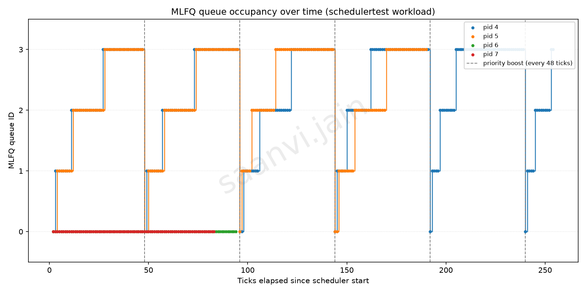

# xv6 Scheduler Report


All data in this report is from real runs of the kernel in QEMU (`riscv64-unknown-elf-gcc`
toolchain, `qemu-system-riscv64`), not simulated or hand-calculated. Every build used
`CPUS=1`, so that processes actually compete for the CPU with the default `CPUS=3` most
processes get a core to themselves and the schedulers look nearly identical.

---

## Implementation Summary

### Makefile / `SCHEDULER` macro

`Makefile` selects the scheduler at compile time from a `SCHEDULER` variable:
`SCHEDULER=MLFQ` defines `-DUSE_MLFQ`, `SCHEDULER=FCFS` defines `-DUSE_FCFS`, and anything else
(including no `SCHEDULER` at all) defines `-DUSE_RR`, the original xv6 behaviour. Doing this at
compile time means only one scheduler's code is ever built into the kernel, so there is no
runtime branching cost and no risk of the wrong policy being reachable. A separate `STATS`
variable (`STATS=1` → `-DSCHED_STATS`) independently turns on the timing/queue logging used for
this report; it is off by default so normal runs stay clean.

### `struct proc` changes (`kernel/proc.h`)

Under `USE_MLFQ`, each process gained three fields: `queue` (priority level, 0 highest to 3
lowest), `enq_time` (an arrival stamp used as a FIFO position within a queue), and `ticks_used`
(ticks consumed in the current time slice). These only exist in the MLFQ build.

Independently of which scheduler is compiled in, every process also gained five comparison
fields, used to measure turnaround/waiting/response time the same way under all three
schedulers: `ctime` (creation tick), `first_run_time` (tick of first dispatch, −1 until then),
`etime` (exit tick, −1 until then), and `rtime`/`wtime` (ticks accumulated RUNNING and RUNNABLE
respectively).

### `allocproc()` changes

Every new process (fresh or a reused slot) is placed at `queue = 0` with `ticks_used = 0` under
MLFQ, so all processes start at the highest priority. Regardless of scheduler, `allocproc()` also
stamps `ctime = ticks` and resets `first_run_time = -1`, `etime = -1`, `rtime = wtime = 0`.

### Queue selection / preemption logic (`scheduler()`)

`scheduler()` has three branches, selected at compile time:

* **MLFQ** — scans every `RUNNABLE` process and remembers the one in the lowest-numbered queue,
  breaking ties by smallest `enq_time` (front of its queue). Only that process runs.
* **FCFS** — scans every `RUNNABLE` process and remembers the one with the smallest `pid`. Since
  pids are handed out in creation order, this always runs whichever eligible process arrived
  earliest.
* **RR (default)** — unchanged from stock xv6: scans the process table in slot order and runs
  the first `RUNNABLE` process found.

Preemption between queues under MLFQ happens in `mlfq_tick()` (below): a process gives up the
CPU as soon as a higher-priority process is `RUNNABLE`, so `scheduler()`'s next pass picks the
higher queue.

### Time-slice handling (`mlfq_tick()`)

Each queue has a fixed slice length, `time_slice[] = {1, 4, 8, 16}` ticks for queues 0–3.
`mlfq_tick()` runs on every timer tick for the currently running process: it increments
`ticks_used`, and once that reaches the queue's slice length, the process is demoted one queue
(queue 3 stays at queue 3 — it is round-robin at the bottom), `ticks_used` resets to 0, and the
process yields. If the slice is not used up, the process keeps running unless some `RUNNABLE`
process is sitting in a strictly higher queue, in which case it yields anyway so that queue can
run.

### Voluntary yield handling

A process that blocks before using its whole slice (`sleep()`, e.g. for I/O or `pause()`) resets
`ticks_used` to 0 but leaves `queue` untouched — it does not get demoted for giving up the CPU
early. When it wakes (`wakeup()`), it is re-enqueued into that same queue with a fresh
`enq_time`, putting it at the back of that queue rather than letting an old stamp put it at the
front. This is what lets I/O-bound processes stay in a high queue indefinitely.

### Priority boosting (`mlfq_boost()`)

Called from `clockintr()` in `trap.c` whenever `ticks % 48 == 0`. It sweeps every non-`UNUSED`
process — `RUNNING`, `RUNNABLE`, or `SLEEPING` — and resets `queue = 0`, `ticks_used = 0`. This
prevents starvation: without it, a steady stream of high-priority work could keep low-queue
processes from ever running.

### `procdump()` changes

Ctrl+P now prints, first, which scheduler the kernel was built with, the current tick count, and
(MLFQ only) ticks since the last boost; then, per process, PID/name/state plus, under MLFQ,
`queue`, `slice` (ticks used / slice length), and `enq_time` stamp. This was the primary tool
used to check each rule above by eye while developing.

### Comparison instrumentation 

Two additions, gated behind `STATS=1` so they add no overhead or output to normal runs:

* `update_times()`, called once per tick from `clockintr()` for every scheduler, increments
  `rtime` for the `RUNNING` process and `wtime` for every `RUNNABLE` one — `wtime` is exactly
  time spent in the ready queue, since `RUNNABLE` is xv6's ready-queue state. Under MLFQ it also
  prints one `QLOG tick=.. pid=.. queue=..` line per active process per tick, the raw data for
  the 2.3.2 plot.
* `kexit()` sets `etime = ticks` and prints one `SCHEDSTAT pid=.. ctime=.. first_run=.. etime=..
  rtime=.. wtime=..` line per process, the raw data for the 2.3.3 comparison.

`user/schedulertest.c` is the test program used for both sections (see 2.3.2 for its workload).

---

## MLFQ Analysis

### Workload

`user/schedulertest.c` forks four children:

| Child (fork order) | Behaviour | Role |
|---|---|---|
| 1st | 9,000,000,000 busy-loop iterations, no waiting | heavy CPU-bound (~150 ticks of work) |
| 2nd | 5,400,000,000 busy-loop iterations, no waiting | medium CPU-bound (~90 ticks of work) |
| 3rd | 30 short CPU bursts, `pause(3)` between each | I/O-bound, long waits |
| 4th | 40 short CPU bursts, `pause(2)` between each | I/O-bound, short waits |

The two CPU-bound children run long enough, and interfere with each other enough under
contention, to be demoted through several queues and to cross more than one 48-tick boost. The
iteration counts were calibrated empirically (200M iterations ≈ 3 ticks, 500M ≈ 9 ticks, ~55–65M
iterations/tick) rather than guessed.

Command used to collect the data:
```
make clean; make qemu CPUS=1 SCHEDULER=MLFQ STATS=1
$ schedulertest
```
The full captured console output is `mlfq_qlog_raw.log` in this folder; `plot_mlfq_timeline.py`
(submitted alongside this report) extracts every `QLOG` line from it and produces the plot below.

### Plot



### Interpretation

The two CPU-bound children (pid 4, pid 5) climb steadily through queues 0→1→2→3 as they use up
each queue's full slice without ever blocking, and every dashed line (every 48 ticks) snaps both
of them straight back down to queue 0, after which the climb repeats — five boosts are visible
across the run. The two I/O-bound children (pid 6, pid 7) never leave queue 0 for their entire
lifetime: each `pause()` call yields before their 1-tick queue-0 slice is used up, so `sleep()`
never demotes them, and they finish (at roughly tick 83 and tick 94) well before the CPU-bound
children even reach their first boost region past tick 100. The heavier child (pid 4, blue)
consistently reaches queue 3 first and spends more total time there than the medium child (pid 5,
orange), matching its larger workload. Because the two CPU-bound children are demoted in lock
step and boosted together, their two step-lines sit almost exactly on top of each other for most
of the run — the plot is showing MLFQ correctly treating processes with similar recent CPU usage
the same way, regardless of how much total work each one has left.

---

## Comparison Results

Same `schedulertest` workload (same 4 children, same fork order), run once under each scheduler
with `STATS=1`, `CPUS=1`. Turnaround = `etime - ctime`, Waiting = `wtime`, Response =
`first_run_time - ctime`, each measured directly in ticks by the kernel, then averaged over the
4 children (the parent process that forks them is not counted — it is test-harness overhead, not
part of the workload being measured).

Commands used:
```
make clean; make qemu CPUS=1 STATS=1                    # RR (no SCHEDULER=)
make clean; make qemu CPUS=1 SCHEDULER=FCFS STATS=1
make clean; make qemu CPUS=1 SCHEDULER=MLFQ STATS=1
```

### Average metrics (ticks)

| Scheduler | Avg. Turnaround ↓ | Avg. Waiting ↓ | Avg. Response ↓ |
|---|---|---|---|
| FCFS | 273.75 | 210.00 | 167.50 |
| RR   | 162.25 | 98.75  | 1.25   |
| MLFQ | **154.25** | **91.00** | **1.25** |

### Per-process detail (ticks)

| Scheduler | pid | role | turnaround | waiting | response |
|---|---|---|---|---|---|
| FCFS | 4 | heavy CPU | 160 | 0 | 0 |
| FCFS | 5 | medium CPU | 255 | 160 | 160 |
| FCFS | 7 | I/O, 40×2 | 335 | 335 | 255 |
| FCFS | 6 | I/O, 30×3 | 345 | 345 | 255 |
| RR | 4 | heavy CPU | 254 | 95 | 0 |
| RR | 5 | medium CPU | 191 | 96 | 1 |
| RR | 6 | I/O, 30×3 | 122 | 122 | 2 |
| RR | 7 | I/O, 40×2 | 82 | 82 | 2 |
| MLFQ | 4 | heavy CPU | 253 | 94 | 0 |
| MLFQ | 5 | medium CPU | 189 | 95 | 1 |
| MLFQ | 6 | I/O, 30×3 | 93 | 93 | 2 |
| MLFQ | 7 | I/O, 40×2 | 82 | 82 | 2 |

### Conclusion 

FCFS is worst on every metric, and the per-process table shows why: it has no time-slicing, so
once the smallest-pid `RUNNABLE` process is dispatched it keeps the CPU until it blocks or exits.
The two I/O-bound children (pids 6, 7) don't get their first tick of CPU until tick 256 — after
*both* CPU-bound children have run to completion — even though their own bursts are tiny; this is
the classic FCFS convoy effect, where short, interactive-style jobs queue up behind long CPU-bound
ones purely because of arrival order. RR fixes exactly this by forcing a yield every tick
regardless of how much work is left, so no single process can monopolize the CPU; that is why its
average waiting time (98.75) is barely a third of FCFS's (210), and every child gets its first
turn within 3 ticks (avg. response 1.25) instead of waiting hundreds of ticks. RR's own weakness
is that it treats every process identically: the I/O-bound children still have to wait behind a
full round of the CPU-bound ones on every cycle before getting each short burst, which is why
their waiting time under RR (82–122) is noticeably worse than under MLFQ (82–93). MLFQ improves on
RR precisely there, a process that blocks quickly (I/O-bound) is never demoted, so once queue 0
has been visited in a round it keeps winning immediately on future ticks, giving it near-RR
response time but lower waiting time, which shows up as MLFQ having the best average turnaround
(154.25) and waiting time (91.00) of the three while matching RR's average response time (1.25).
The trade-off is complexity: MLFQ needs per-queue slice accounting and a periodic boost to avoid
starving long jobs, machinery that plain RR and FCFS do not need at all.
